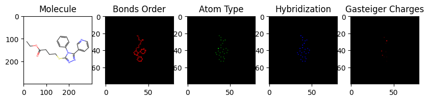
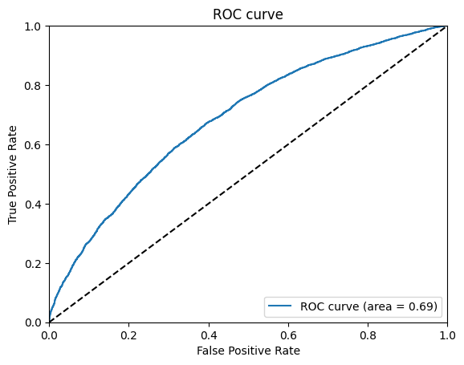
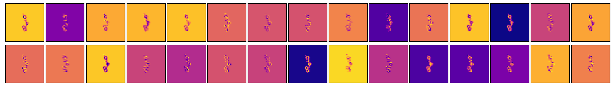
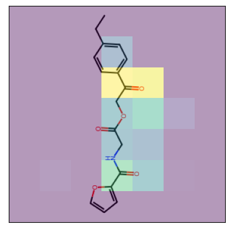

# Drug Discovery using Virtual Screening
This project aims to develop a computational approach for drug discovery using virtual screening techniques. Virtual screening is a computational method that involves screening large chemical libraries to identify potential drug candidates. It can significantly reduce the time and cost required for the initial stages of drug discovery.

# Project Overview
The project consists of several steps:

* Data Preparation: The project utilizes a dataset of chemical compounds and their corresponding biological activities. The dataset is preprocessed and featurized using the ChemCeption model.

* Model Building: The ChemCeption model, which is based on the InceptionV3 architecture, is used to predict the biological activity of the chemical compounds. The model is trained using the preprocessed data.
* Model Evaluation: The trained model is evaluated using a separate test dataset. The performance of the model is measured using metrics such as ROC curve and AUC score.

* Kernel Visualization: The project includes techniques for visualizing the model's decision-making process, such as kernel visualization and Grad-CAM.

# Installation
To run the project, follow these steps:

Clone the repository:
> git clone https://github.com/your_username/project.git
Install the required dependencies: 
> pip install -r requirements.txt

# Evaluation
The project achieves an ROC score of 0.69, indicating a good performance in predicting the biological activity of chemical compounds. 

# Usage
Run the inference.ipynb